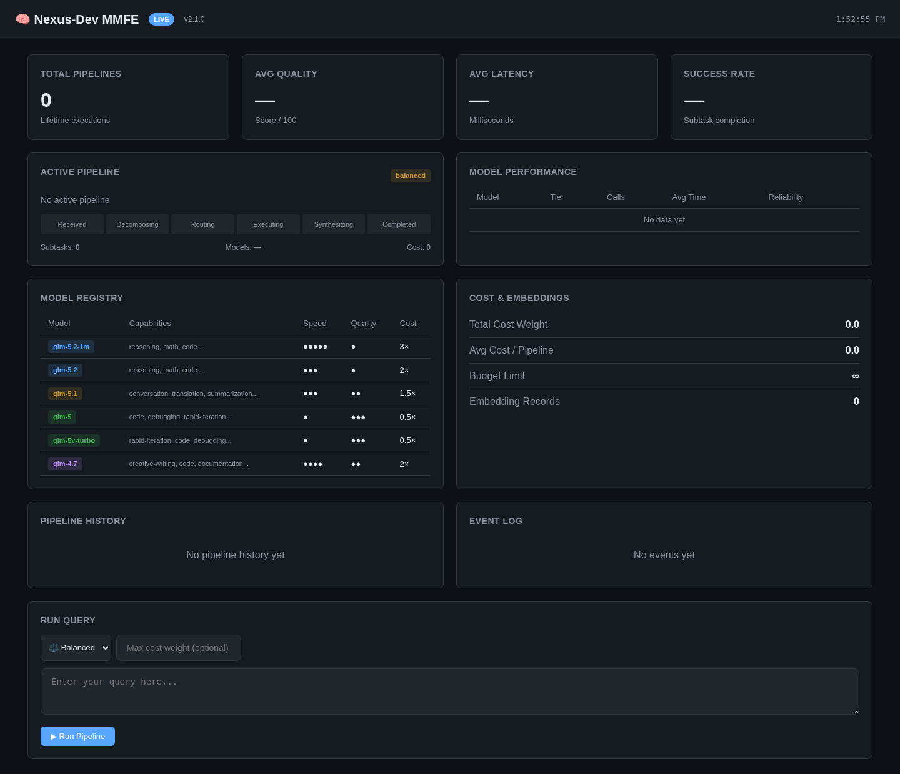

<div align="center">

# 🧠 Nexus-Dev MMFE

### Multi-Model Fusion Engine

**An intelligent multi-model orchestration framework that decomposes complex tasks, adaptively routes subtasks to the optimal GLM models, executes them in parallel, and synthesizes a single unified answer — with MTP hyperthreading, code review, and AI SLOPE elimination for design tasks.**

[](#v50-features---nexus-code-tui)
[](LICENSE)
[](https://nodejs.org/)
[](https://www.typescriptlang.org/)
[](https://www.npmjs.com/package/nexus-code)

[Installation](#installation) · [Quick Start](#quick-start) · [Nexus Code TUI](#nexus-code--terminal-ai-coding-assistant) · [Architecture](#architecture) · [API Reference](#api-reference) · [Design Skill](#design-skill--ai-slope-elimination) · [Code Review](#code-review-engine) · [MTP](#mtp-multi-threaded-pipeline)

</div>

---

## Table of Contents

- [Overview](#overview)
- [Key Features](#key-features)
- [How It Works](#how-it-works)
- [Architecture](#architecture)
  - [Pipeline Overview](#pipeline-overview)
  - [Component Diagram](#component-diagram)
  - [Data Flow](#data-flow)
- [Supported Models](#supported-models)
  - [Model Profiles](#model-profiles)
  - [Capability Matrix](#capability-matrix)
  - [Execution Modes](#execution-modes)
- [Installation](#installation)
  - [Prerequisites](#prerequisites)
  - [Install from Source](#install-from-source)
  - [SDK Configuration](#sdk-configuration)
- [Quick Start](#quick-start)
  - [Basic Usage](#basic-usage)
  - [CLI Usage](#cli-usage)
  - [Design Command](#design-command)
  - [Code Review Command](#code-review-command)
  - [MTP Hyperthreading](#mtp-hyperthreading)
- [Design Skill — AI SLOPE Elimination](#design-skill--ai-slope-elimination)
  - [What is AI SLOPE?](#what-is-ai-slope)
  - [Design Pipeline](#design-pipeline)
  - [Design Sub-Domains](#design-sub-domains)
  - [AI SLOPE Detection Categories](#ai-slope-detection-categories)
  - [Design Knowledge Base](#design-knowledge-base)
  - [Design Skill SDK](#design-skill-sdk)
- [Code Review Engine](#code-review-engine)
  - [5-Phase Review Pipeline](#5-phase-review-pipeline)
  - [Supported Languages](#supported-languages)
  - [Code Review SDK](#code-review-sdk)
- [MTP (Multi-Threaded Pipeline)](#mtp-multi-threaded-pipeline)
  - [Thread Types](#thread-types)
  - [MTP Performance](#mtp-performance)
- [Using Nexus with Agentic Tools](#using-nexus-with-agentic-tools)
  - [Claude Code](#claude-code)
  - [OpenAI Codex](#openai-codex)
  - [Open Code](#open-code)
  - [Zcode](#zcode)
  - [Hermes Agent](#hermes-agent)
  - [OpenClaw](#openclaw)
  - [Pi (Inflection)](#pi-inflection)
  - [Kimi Code](#kimi-code)
  - [Mimo Code](#mimo-code)
  - [Antigravity](#antigravity)
  - [Gemini CLI](#gemini-cli)
  - [Cursor](#cursor)
  - [Windsurf / Codeium](#windsurf--codeium)
  - [Aider](#aider)
  - [Continue](#continue)
  - [Cline](#cline)
  - [Generic Integration Pattern](#generic-integration-pattern)
- [API Reference](#api-reference)
  - [Orchestrator](#orchestrator)
  - [Types](#types)
  - [Model Registry](#model-registry-api)
  - [Configuration](#configuration-api)
- [Routing Algorithm](#routing-algorithm)
  - [Scoring Formula](#scoring-formula)
  - [Mode Influence](#mode-influence)
  - [Load Balancing](#load-balancing)
  - [Dependency Resolution](#dependency-resolution)
- [Advanced Usage](#advanced-usage)
  - [Custom System Prompts](#custom-system-prompts)
  - [Context-Aware Processing](#context-aware-processing)
  - [Quality Assurance Pipeline](#quality-assurance-pipeline)
  - [Runtime Configuration](#runtime-configuration)
  - [Pipeline Monitoring](#pipeline-monitoring)
- [CLI Reference](#cli-reference)
- [Configuration](#configuration)
  - [Full Options Table](#full-options-table)
  - [Preset Configurations](#preset-configurations)
- [Project Structure](#project-structure)
- [Testing](#testing)
- [Examples](#examples)
- [Contributing](#contributing)
- [Roadmap](#roadmap)
- [Changelog](#changelog)
- [License](#license)

---

## Overview

Nexus-Dev MMFE is an **adaptive orchestration layer** that transforms any complex request into a coordinated, parallel execution across multiple GLM models. Rather than relying on a single model for everything — and accepting its weaknesses alongside its strengths — Nexus-Dev decomposes your request, assigns each piece to the model best suited for it, runs them all simultaneously, and then intelligently merges the results into one polished, unified answer.

Think of it as assembling a team of specialists: a reasoning expert, a speed demon, a creative writer, a code synthesizer — all working in parallel on different aspects of your request, with a lead architect who combines their outputs into something better than any individual could produce alone.

### Why Multi-Model?

| Single Model                                             | Multi-Model Fusion                                         |
| -------------------------------------------------------- | ---------------------------------------------------------- |
| One model's strengths & weaknesses applied to everything | Each subtask gets a model specialized for it               |
| Sequential processing of complex tasks                   | Parallel execution across independent subtasks             |
| Quality limited by the weakest capability of one model   | Quality elevated by the strongest capability of each model |
| Fixed speed/quality tradeoff                             | Dynamically adjustable via execution modes                 |
| Generic AI design output                                 | AI SLOPE elimination for design tasks                      |
| Single-perspective code review                           | Multi-model review with independent fact-checking          |

---

## Key Features

- **Nexus Code TUI** — Terminal AI coding assistant with Ink + React, multi-provider chat, slash commands, streaming, tool calling, MCP support, and MMFE built in
- **Adaptive Routing Layer (ARL)** — Weighted multi-factor scoring (capability 40pts, mode 30pts, complexity 20pts, load balance) routes each subtask to the optimal model
- **Parallel Execution** — Dependency-aware wave-based parallel execution with automatic retry on alternative models
- **Intelligent Synthesis** — Flagship model merges all subtask results with quality scoring and automatic refinement loops
- **4 Execution Modes** — `speed`, `quality`, `balanced`, `creative` — each adjusts routing weights to favor different model profiles
- **MTP Hyperthreading** — CPU-like speculative decomposition, speculative execution, incremental synthesis, and concurrent quality scoring for up to 2.83x speedup
- **Code Review Engine** — 5-phase pipeline adapted from Alibaba Open Code Review with 14 language-specific rule sets and independent fact-checking filter
- **Design Skill with AI SLOPE Elimination** — BM25 search across 9 design domains (600+ entries), design system generation, and 10-category AI SLOPE detection/elimination
- **Multi-Turn Conversations** — Context persistence across turns with conversation tracking
- **Budget-Aware Routing** — Cap total cost weight per orchestration run
- **Event Streaming** — Real-time pipeline events for monitoring and integration
- **Performance Tracking** — Record and query model reliability statistics over time

---

## How It Works

```
1. You submit a complex request
2. The Decomposer (glm-5.2) breaks it into independent subtasks
3. The Adaptive Router scores each subtask against all models
4. The Parallel Executor runs subtasks simultaneously (respecting dependencies)
5. The Synthesizer (glm-5.2 + glm-4.7) merges all results
6. Quality scoring determines if re-synthesis is needed
7. You receive a unified, polished answer
```

---

## Architecture

### Pipeline Overview

```
┌─────────────┐     ┌──────────────┐     ┌────────────────┐     ┌────────────┐
│   Request    │────▶│  Decomposer  │────▶│  Adaptive Router│────▶│  Parallel  │
│             │     │  (glm-5.2)   │     │     (ARL)      │     │  Executor  │
└─────────────┘     └──────────────┘     └────────────────┘     └─────┬──────┘
                                                                        │
                          ┌──────────────┐                              │
                          │  Synthesizer │◀─────────────────────────────┘
                          │  (glm-5.2 +  │
                          │   glm-4.7)   │
                          └──────┬───────┘
                                 │
                          ┌──────▼───────┐
                          │ Unified Result│
                          └──────────────┘
```

### Component Diagram

```
Nexus-Dev MMFE
├── Core Pipeline
│   ├── Decomposer ──────────── Task splitting with dependency graph
│   ├── Adaptive Router ─────── Multi-factor weighted scoring + topological sort
│   ├── Parallel Executor ───── Wave-based concurrent execution with retry
│   └── Synthesizer ─────────── Merge + quality scoring + refinement loop
│
├── Specialized Pipelines
│   ├── MTP Engine ──────────── Hyperthreaded pipeline (9 thread types, 8 phases)
│   ├── Code Review Engine ──── 5-phase review (Plan → Review → Synth → Filter → Re-Loc)
│   └── Design Skill Engine ─── 8-phase design with AI SLOPE elimination
│
├── Infrastructure
│   ├── Model Registry ──────── 6 GLM models with 16+ capabilities each
│   ├── Budget Routing ──────── Cost-weight-aware model selection
│   ├── Conversation Manager ── Multi-turn context persistence
│   ├── Event Emitter ───────── Real-time pipeline streaming
│   ├── Performance Tracker ─── Model reliability statistics
│   └── Embedding Similarity ── Task similarity for cache/reuse
```

### Data Flow

```
Request → [Analyze] → [Decompose] → [Route] → [Execute Wave 1] → [Execute Wave 2] → ... → [Synthesize] → [Quality Score] → Result
                                    ↕                                    ↕                        ↕
                              Routing Decision              SubTaskResult[]          QualityScore > threshold?
                                    ↕                                    ↕                        ↓ yes
                              Model Assignment              Partial results           [Re-Synthesize with feedback]
```

---

## v4.0 Features — Multi-Provider

Nexus-Dev MMFE v4.0 introduces a **Provider Abstraction Layer** that enables routing across multiple LLM providers — not just ZAI/GLM models. The same orchestration pipeline (decompose → route → execute → synthesize) now works with models from any provider.

### Supported Providers

| Provider          | Adapter             | Auth                                                  | Models                                                     |
| ----------------- | ------------------- | ----------------------------------------------------- | ---------------------------------------------------------- |
| **ZAI** (default) | `ZAIProvider`       | Auto-detected via `z-ai-web-dev-sdk`                  | glm-5.2-1m, glm-5.2, glm-5.1, glm-5, glm-5v-turbo, glm-4.7 |
| **OpenAI**        | `OpenAIProvider`    | `OPENAI_API_KEY` env var or config                    | gpt-4o, gpt-4.1, gpt-4.1-mini, o3, o4-mini                 |
| **Anthropic**     | `AnthropicProvider` | `ANTHROPIC_API_KEY` env var or config                 | claude-opus-4, claude-sonnet-4, claude-haiku-3.5           |
| **Google**        | `GoogleProvider`    | `GOOGLE_API_KEY` / `GEMINI_API_KEY` env var or config | gemini-2.5-pro, gemini-2.5-flash, gemini-2-flash           |

### Multi-Provider Configuration

```javascript
import { createOrchestrator } from 'nexus-dev-mmf';

const orch = createOrchestrator({
  providers: {
    defaultProvider: 'zai',
    enableFallback: true,
    providers: {
      zai: { provider: 'zai' }, // Auto-detected
      openai: { provider: 'openai', apiKey: process.env.OPENAI_API_KEY },
      anthropic: {
        provider: 'anthropic',
        apiKey: process.env.ANTHROPIC_API_KEY,
      },
      google: { provider: 'google', apiKey: process.env.GOOGLE_API_KEY },
    },
  },
});

await orch.initialize(); // Initialize all configured providers

// Now the router can assign subtasks to any available model across providers
const result = await orch.process('Explain quantum computing and write a Python simulation');
// May route: reasoning → o3, code → gpt-4.1, creative-explanation → claude-sonnet-4
```

### Provider Prefix Routing

You can explicitly route to a specific provider using the `provider/model` prefix:

```javascript
// Explicit provider routing
const result = await orch.process('Analyze this code', {
  customSystemPrompt: 'Use openai/o3 for deep reasoning on this task',
});

// In the model registry, models can be referenced with or without prefix:
// "gpt-4o"           → routes to OpenAI (auto-detected from registry)
// "openai/gpt-4o"    → explicitly routes to OpenAI
// "claude-sonnet-4"  → routes to Anthropic (auto-detected from registry)
```

### Cross-Provider Pipeline

The real power of multi-provider is mixing models from different providers in the same pipeline:

```
Task: "Design and implement a fintech API"
├── Decompose: glm-5.2 (ZAI) — understands the full context
├── Route: reasoning → o3 (OpenAI), code → gpt-4.1 (OpenAI), design → claude-sonnet-4 (Anthropic)
├── Execute: All subtasks run in parallel across 3 providers
├── Synthesize: gemini-2.5-pro (Google) — merges all results
└── Quality Score: 92/100
```

### Environment Variables

```bash
# ZAI — auto-detected, no env vars needed in chat.z.ai
# ZAI_PROVIDER_BASE_URL=https://custom-endpoint  # Optional override

# OpenAI
OPENAI_API_KEY=sk-...
# OPENAI_BASE_URL=https://api.openai.com/v1      # Optional override
# OPENAI_ORG_ID=org-...                            # Optional

# Anthropic
ANTHROPIC_API_KEY=sk-ant-...
# ANTHROPIC_BASE_URL=https://api.anthropic.com # Optional override (no /v1 — appended automatically)

# Google
GOOGLE_API_KEY=AIza...     # or GEMINI_API_KEY
# GOOGLE_AI_BASE_URL=...   # Optional override
```

### Custom Provider

You can implement your own provider by implementing the `LLMProvider` interface:

```javascript
import { LLMProvider, ProviderId, ProviderConfig, ProviderMessage, ProviderCompletionOptions, ProviderCompletionResult } from 'nexus-dev-mmf';

class MyCustomProvider implements LLMProvider {
  readonly providerId: ProviderId = 'zai';  // or register a new ID
  readonly name = 'My Custom Provider';
  readonly supportedModels = ['my-model-1'];
  get isReady() { return true; }

  async initialize(config: ProviderConfig) { /* ... */ }
  async complete(model, messages, options) { /* ... */ }
  async healthCheck() { return true; }
  listModels() { return this.supportedModels; }
  supportsModel(id) { return this.supportedModels.includes(id); }
  async shutdown() { /* ... */ }
}

// Register with the orchestrator
const orch = createOrchestrator({ /* ... */ });
orch.getProviderRouter().registerProvider(new MyCustomProvider());
```

---

## Supported Models

### Model Profiles

#### ZAI (GLM Models) — Default Provider

| Model          | Tier     | Cost Weight | Context     | Key Strengths                                                                     |
| -------------- | -------- | ----------- | ----------- | --------------------------------------------------------------------------------- |
| `glm-5.2-1m`   | Flagship | 3.0         | 1M tokens   | Advanced reasoning, complex decomposition, SLOPE detection, long-context analysis |
| `glm-5.2`      | Flagship | 2.0         | 128K tokens | High-performance baseline, design generation, balanced quality-speed              |
| `glm-5.1`      | Standard | 1.5         | 128K tokens | Nuanced language, context sensitivity, design copy, multi-turn                    |
| `glm-5`        | Fast     | 0.5         | 32K tokens  | Speed, efficiency, rapid drafts, high-throughput tasks                            |
| `glm-5v-turbo` | Fast     | 0.5         | 32K tokens  | Accelerated feedback, vision support, quick iteration                             |
| `glm-4.7`      | Creative | 2.0         | 128K tokens | Creative generation, deep knowledge, design systems, synthesis                    |

#### OpenAI Models

| Model          | Tier     | Cost Weight | Context     | Key Strengths                                                  |
| -------------- | -------- | ----------- | ----------- | -------------------------------------------------------------- |
| `gpt-4o`       | Flagship | 2.5         | 128K tokens | Multimodal, strong reasoning + code + vision                   |
| `gpt-4.1`      | Flagship | 2.0         | 1M tokens   | High intelligence, complex instruction following, long context |
| `gpt-4.1-mini` | Standard | 1.0         | 1M tokens   | Balanced intelligence and speed, 1M context                    |
| `o3`           | Flagship | 4.0         | 200K tokens | Deep chain-of-thought reasoning, math, science, complex logic  |
| `o4-mini`      | Standard | 1.5         | 200K tokens | Fast reasoning, good balance of capability and cost            |

#### Anthropic Models (Claude)

| Model              | Tier     | Cost Weight | Context     | Key Strengths                                                      |
| ------------------ | -------- | ----------- | ----------- | ------------------------------------------------------------------ |
| `claude-opus-4`    | Flagship | 5.0         | 200K tokens | Most capable, complex reasoning, creative writing, SLOPE detection |
| `claude-sonnet-4`  | Flagship | 3.0         | 200K tokens | Balanced performance, excellent code and reasoning, design         |
| `claude-haiku-3.5` | Fast     | 0.8         | 200K tokens | Fast and affordable, high-throughput tasks                         |

#### Google Models (Gemini)

| Model              | Tier     | Cost Weight | Context   | Key Strengths                                        |
| ------------------ | -------- | ----------- | --------- | ---------------------------------------------------- |
| `gemini-2.5-pro`   | Flagship | 3.0         | 1M tokens | 1M context + thinking, multimodal, complex reasoning |
| `gemini-2.5-flash` | Fast     | 0.5         | 1M tokens | Fast with 1M context + thinking, efficient           |
| `gemini-2-flash`   | Fast     | 0.3         | 1M tokens | Ultra-fast, simple tasks and vision at minimal cost  |

### Capability Matrix

Each model is rated across 16+ capabilities. The router uses these scores alongside mode weights to pick the best model for each subtask.

| Capability       | glm-5.2-1m | glm-5.2 | glm-5.1 | glm-5 | glm-5v-turbo | glm-4.7 |
| ---------------- | :--------: | :-----: | :-----: | :---: | :----------: | :-----: |
| reasoning        |     95     |   90    |   82    |  72   |      68      |   78    |
| code             |     90     |   88    |   80    |  75   |      65      |   72    |
| creative-writing |     78     |   82    |   85    |  70   |      65      |   92    |
| analysis         |     93     |   88    |   80    |  72   |      68      |   75    |
| summarization    |     88     |   85    |   82    |  80   |      78      |   80    |
| translation      |     82     |   85    |   90    |  82   |      75      |   78    |
| math             |     92     |   85    |   75    |  68   |      62      |   70    |
| science          |     90     |   82    |   75    |  65   |      60      |   72    |
| design           |     70     |   82    |   80    |  68   |      65      |   90    |
| code-review      |     88     |   85    |   78    |  70   |      65      |   75    |
| slope-detection  |     85     |   80    |   72    |  60   |      58      |   70    |
| design-system    |     68     |   78    |   75    |  62   |      60      |   88    |

### Execution Modes

| Mode       | Weight Profile                                    | Best For                                     |
| ---------- | ------------------------------------------------- | -------------------------------------------- |
| `speed`    | Prioritizes fast models (glm-5, glm-5v-turbo)     | Drafts, rapid iteration, time-critical tasks |
| `quality`  | Prioritizes flagship models (glm-5.2, glm-5.2-1m) | Final deliverables, accuracy-critical work   |
| `balanced` | Balances speed and quality across all models      | General-purpose (default)                    |
| `creative` | Biases toward creative models (glm-4.7)           | Writing, design, brainstorming               |

---

## Installation

### Prerequisites

- **Node.js** 18+ (recommended: 20+)
- **z-ai-web-dev-sdk** installed and configured with valid credentials
- **TypeScript** 5.4+ (for building from source)

### Install from Source

```bash
# Clone the repository
git clone https://github.com/roman-ryzenadvanced/nexus-dev-mmf.git
cd nexus-dev-mmf

# Install dependencies
npm install

# Build TypeScript
npm run build

# Verify installation
node dist/cli.js --help
```

### SDK Configuration

Nexus-Dev uses `z-ai-web-dev-sdk` to access GLM models. The SDK must be configured before use:

```bash
# The SDK reads configuration from .z-ai-config or environment variables
# Ensure your credentials are set up (the SDK auto-detects in most environments)
```

The `.env` file in the project root is used for local development overrides:

```env
# Nexus-Dev MMFE Configuration
NEXUS_MODE=balanced
NEXUS_MAX_PARALLEL=6
NEXUS_TIMEOUT=120000
```

---

## Quick Start

### Basic Usage

```javascript
import { createOrchestrator } from 'nexus-dev-mmf';

const orch = createOrchestrator({
  defaultMode: 'balanced',
  maxParallelSubTasks: 6,
});

const result = await orch.process('Explain the tradeoffs between microservices and monoliths, then write a TypeScript implementation of a service mesh');

console.log(result.answer);
console.log(`Quality: ${result.qualityScore}/100`);
console.log(`Models used: ${result.routingDecisions.map(d => d.modelId).join(', ')}`);
```

### CLI Usage

```bash
# General query
nexus-dev "Explain the difference between microservices and monoliths"

# Quality mode for critical tasks
nexus-dev "Design a database schema" --mode quality

# Speed mode for drafts
nexus-dev "Quick summary of React hooks" --mode speed

# Creative mode for writing
nexus-dev "Write a creative product description" --mode creative
```

### Design Command

```bash
# Design with AI SLOPE elimination
nexus-dev design "Create a fintech dashboard landing page" --brand PayFlow

# With industry and stack context
nexus-dev design "SaaS homepage" --brand Acme --industry tech --stack nextjs --mode creative

# Disable SLOPE detection (faster, but may produce generic output)
nexus-dev design "Healthcare app UI" --no-slope

# Verbose output with pipeline metrics
nexus-dev design "E-commerce product page" --verbose
```

### Code Review Command

```bash
# Basic code review
node scripts/code-review.mjs "$(git diff HEAD~1)"

# With MTP hyperthreading for faster reviews
node scripts/code-review.mjs "$(git diff HEAD~1)" --mtp

# Review a specific file's changes
node scripts/code-review.mjs "$(git diff -- myfile.ts)"
```

### MTP Hyperthreading

```bash
# Run with MTP hyperthreading (speculative decomposition + execution)
node scripts/mtp-fusion.mjs "Complex multi-step task requiring multiple model capabilities"
```

---

## Nexus Code — Terminal AI Coding Assistant

**Nexus Code** (`nexus-code`) is a terminal UI client for chatting with GLM, OpenAI, Anthropic, and any OpenAI-compatible endpoint — with the Multi-Model Fusion Engine built in. It lives at `packages/nexus-code/`.

> ### 🖥️ Is it a terminal app or a web app?
>
> **It is a terminal/TUI app first.** Nexus Code runs **inside your terminal** — it is _not_ a hosted web product.
>
> | Mode                        | Command       | What it is                                                                                                                                                                                                                                                  |
> | --------------------------- | ------------- | ----------------------------------------------------------------------------------------------------------------------------------------------------------------------------------------------------------------------------------------------------------- |
> | **Terminal UI (primary)**   | `nexus`       | A full-screen, interactive **terminal UI** built with [Ink](https://github.com/vadimdemedes/ink) + React. Runs natively in your console — **no browser, no server, nothing hosted online.** This is what most people use.                                   |
> | **Local web UI (optional)** | `nexus --web` | For convenience only. Boots a small HTTP server bound to **`127.0.0.1:3000` (your own machine)** and serves a browser chat page. The "web" UI runs **entirely on localhost** from the same CLI binary — it is never deployed or reachable over the network. |
>
> **There are no hosted/web screenshots in this repository.** Every visual you see is a **terminal/ANSI render** of the TUI, not a web page. If a screenshot looks like a polished app, that is the TUI rendering in a terminal — not a browser.

### Install

```bash
npm install -g nexus-code
```

Or run from source:

```bash
cd packages/nexus-code
npm install
npm run build
node bin/nexus.js
```

### Features

- **Three provider kinds**: OpenAI-compatible, Anthropic, Z.ai (MMFE native)
- **Auto-fetch models** via `/v1/models` for OpenAI + Anthropic
- **Manual model add** via `/add` slash command or config file
- **MMFE orchestrator built in** — mode switcher, routing panel, quality score
- **Provider unlocked** — bypass MMFE with `/mmfe off` for direct provider calls
- **Streaming responses** with token-by-token rendering
- **20 slash commands**: `/mode`, `/model`, `/provider`, `/clear`, `/save`, `/load`, `/fetch`, `/add`, `/mcp`, `/diff`, `/init`, `/branch`, `/theme`, `/status`, `/history`, `/plugins`, `/help`, `/exit`, and more
- **Input history** (up/down arrow navigation, persisted to `~/.nexus/history.json`)
- **Session persistence** — save and load chat transcripts
- **File context tools** (`fs`, `shell`, `diff`, `apply_diff`)
- **MCP support** (Model Context Protocol) — stdio + HTTP transports
- **Plugin system** — load custom tools/commands from `~/.nexus/plugins/*.js`
- **Command palette** (Ctrl+P) — fuzzy-filter slash commands
- **Web UI** (`nexus --web`) — local HTTP server + browser chat with SSE streaming
- **Pipe mode** — `echo "prompt" | nexus` for scripting
- **3 TUI themes**: tech-dark, editorial-light, hacker-terminal
- **230+ tests** passing with 61% coverage

### Screenshots

**Web UI** — Browser-based chat interface launched with `nexus --web`. Features SSE streaming, provider/model/mode selectors, MMFE toggle, and quality scoring.


**Dashboard** — Interactive HTML5 monitoring dashboard with live pipeline stats, model performance, cost tracking, and event log.



### Quick Start

```bash
# Set API keys (any subset)
export ZAI_API_KEY=...
export OPENAI_API_KEY=...
export ANTHROPIC_API_KEY=...

# Boot the TUI
nexus
```

### First-Run Setup

On first launch, `nexus-code` creates `~/.nexus/config.json` with three default providers (zai, openai, anthropic). Edit it to add custom providers, API keys, or manual model entries.

### Adding a Custom Provider

Edit `~/.nexus/config.json`:

```json
{
  "providers": [
    {
      "id": "openrouter",
      "kind": "openai",
      "name": "OpenRouter",
      "baseURL": "https://openrouter.ai/api/v1",
      "apiKey": "sk-or-...",
      "mmfe": false,
      "defaultModel": "anthropic/claude-3.5-sonnet"
    },
    {
      "id": "ollama-local",
      "kind": "openai",
      "name": "Ollama (local)",
      "baseURL": "http://localhost:11434/v1",
      "mmfe": false,
      "defaultModel": "llama3.1:8b"
    }
  ]
}
```

### Nexus Code Documentation

| Doc                                                                        | Description                              |
| -------------------------------------------------------------------------- | ---------------------------------------- |
| [Features](./packages/nexus-code/docs/FEATURES.md)                         | Every feature, version added, how to use |
| [Tests](./packages/nexus-code/docs/TESTS.md)                               | Every test suite, coverage, how to run   |
| [Root Cause Analysis](./packages/nexus-code/docs/ROOT-CAUSE-ANALYSIS.md)   | Every bug, root cause, exact fix         |
| [Release Notes v1.1.7](./packages/nexus-code/docs/RELEASE-NOTES-v1.1.7.md) | Consolidated release notes               |
| [Providers](./packages/nexus-code/docs/providers.md)                       | Provider setup and configuration         |
| [Slash Commands](./packages/nexus-code/docs/commands.md)                   | Full command reference                   |
| [MCP Integration](./packages/nexus-code/docs/mcp.md)                       | Model Context Protocol setup             |
| [Architecture](./packages/nexus-code/docs/architecture.md)                 | Internal architecture overview           |
| [Example Config](./packages/nexus-code/examples/config.json)               | Full config example                      |

---

## Design Skill — AI SLOPE Elimination

### What is AI SLOPE?

**AI SLOPE** = **A**I-generated **S**ameness, **L**ack of **O**riginality, **O**ver-reliance on **P**atterns, **E**mptiness

AI SLOPE is the generic, template-like quality that makes AI-generated designs instantly recognizable as machine-produced. Common indicators include:

- **Default blue (#3B82F6)** or **AI purple (#6366F1)** as primary colors
- **Centered hero + 3-column features + CTA** (the "AI special" layout)
- **"Empower your workflow"**, **"Revolutionize your X"** cliché microcopy
- **Backdrop-blur on every element** without purpose
- **Uniform spacing and border-radius** everywhere — no rhythm
- **No signature visual element** unique to the brand
- **Inter-only typography** with no hierarchy
- **Lucide icons without customization** — every AI app looks the same

### Design Pipeline

The design skill runs an 8-phase pipeline that detects and eliminates AI SLOPE:

```
1. ANALYZE        → Detect design sub-domain, product type, style keywords
2. SEARCH         → BM25 search across design knowledge base (9 domains, 600+ entries)
3. GENERATE DS    → Aggregate search results into a design system with reasoning rules
4. PROMPT ENGINE  → Build SLOPE-aware design prompts for each model
5. EXECUTE        → Multi-model parallel design generation (3 models per request)
6. SLOPE DETECT   → Cross-model review for 10 categories of AI SLOPE
7. ELIMINATE      → Re-generate with anti-slope instructions if threshold exceeded
8. SYNTHESIZE     → Merge best elements from all model outputs into final result
```

### Design Sub-Domains

| Sub-domain      | Purpose                       | Example Use                                       |
| --------------- | ----------------------------- | ------------------------------------------------- |
| `brand`         | Brand identity, voice, assets | Brand guidelines, color palette, tone of voice    |
| `design-system` | Token architecture, specs     | Design tokens, component specs, spacing scale     |
| `ui-styling`    | Component implementation      | shadcn/ui theming, Tailwind config, CSS variables |
| `logo`          | AI logo generation            | SVG logo with brand personality                   |
| `cip`           | Corporate Identity Program    | Letterheads, business cards, presentations        |
| `slides`        | HTML presentations            | Pitch decks with Chart.js visualizations          |
| `banner`        | Banner design                 | Social media ads, web banners, print              |
| `icon`          | SVG icon generation           | Custom icon set with brand style                  |
| `social-photos` | Social media images           | OG images, profile graphics                       |
| `ux-audit`      | UX review                     | Accessibility audit, heuristic evaluation         |

### AI SLOPE Detection Categories

| Category                 | Severity  | Key Indicator                               | Anti-Pattern                                  |
| ------------------------ | --------- | ------------------------------------------- | --------------------------------------------- |
| `generic-colors`         | 🔴 High   | Default blue (#3B82F6), AI purple (#6366F1) | Product-specific palettes from knowledge base |
| `template-layout`        | 🔴 High   | Centered hero + 3-column features + CTA     | Asymmetric layouts, unique grid structures    |
| `missing-brand-identity` | 🔴 High   | No signature visual element                 | Brand-specific color, shape, or pattern       |
| `stock-imagery`          | 🟡 Medium | Generic hero images                         | Product-specific illustration style           |
| `flat-typography`        | 🟡 Medium | No hierarchy, Inter-only                    | Varied weights, brand fonts, contrast         |
| `overused-effects`       | 🟡 Medium | Backdrop-blur on everything                 | Purposeful effects, selective application     |
| `cliche-microcopy`       | 🟢 Low    | "Empower your workflow"                     | Product-specific language, personality        |
| `uniform-spacing`        | 🟢 Low    | Same padding everywhere                     | Rhythm variation, intentional density         |
| `default-icon-sets`      | 🟢 Low    | Lucide without customization                | Branded icons, custom illustrations           |
| `predictable-animations` | 🟢 Low    | Fade-in-up on everything                    | Varied timing, unexpected motion              |

### Design Knowledge Base

The design skill includes a comprehensive BM25-searchable knowledge base:

| Domain        | Rows | Content                                          |
| ------------- | ---- | ------------------------------------------------ |
| Products      | 161  | Product-specific style recommendations           |
| Styles        | 84   | UI styles with colors, effects, accessibility    |
| Colors        | 161  | Product-specific color palettes (17 tokens each) |
| Typography    | 73   | Font pairings with Google Fonts URLs             |
| Landing       | 34   | Landing page patterns and CTA strategies         |
| Charts        | 25   | Chart type recommendations by data type          |
| UX Guidelines | 99   | UX best practices with Do/Don't examples         |
| UI Reasoning  | 161  | Decision rules and anti-patterns per product     |
| Stacks        | 14   | React, Next.js, Vue, Svelte, Flutter, etc.       |

### Design Skill SDK

```javascript
import { createDesignSkillEngine } from 'nexus-dev-mmf';

const engine = createDesignSkillEngine({
  enableSlopeDetection: true,
  enableDesignSystem: true,
  slopeThreshold: 40, // Re-generate if SLOPE score >= 40
  maxSlopeRetries: 2, // Max elimination attempts
  defaultMode: 'balanced',
});

const result = await engine.process({
  id: 'design-001',
  query: 'Design a fintech dashboard landing page',
  productType: 'Fintech/Crypto',
  brandName: 'PayFlow',
  industry: 'fintech',
  enableSlopeDetection: true,
  enableDesignSystem: true,
  mode: 'balanced',
});

console.log(result.designOutput);
console.log(`SLOPE Score: ${result.slopeReport.slopeScore}/100`);
console.log(`Originality: ${result.slopeReport.originalityScore}/100`);
console.log(`Detected SLOPE categories: ${result.slopeReport.detectedCategories.join(', ')}`);
```

---

## Code Review Engine

Adapted from [Alibaba Open Code Review](https://github.com/alibaba/open-code-review) with multi-model fusion enhancements.

### 5-Phase Review Pipeline

```
1. PLAN          → Risk analysis, identify critical areas in the diff
2. REVIEW        → Multi-model parallel code review with language-specific rules
3. SYNTHESIZE    → Flagship model merges all review findings
4. FILTER        → Independent fact-checking filter (falsify, not verify)
5. RE-LOCATE     → Re-locate filtered comments to precise code lines
```

### Supported Languages

14 language-specific rule sets with tailored review prompts:

| Language   | Rules Focus                                  |
| ---------- | -------------------------------------------- |
| TypeScript | Type safety, null handling, async patterns   |
| JavaScript | Scope, coercion, prototype pitfalls          |
| Python     | Type hints, resource management, concurrency |
| Java       | Null safety, streams, exceptions             |
| Rust       | Ownership, lifetimes, unsafe blocks          |
| Go         | Error handling, goroutines, channels         |
| C++        | Memory management, RAII, UB prevention       |
| C#         | LINQ, async/await, disposables               |
| Ruby       | Duck typing, blocks, metaprogramming         |
| PHP        | Type safety, SQL injection, XSS              |
| Swift      | Optionals, value types, concurrency          |
| Kotlin     | Null safety, coroutines, extensions          |
| Scala      | Pattern matching, implicits, collections     |
| Shell/Bash | Quoting, error handling, portability         |

### Code Review SDK

```javascript
import { createCodeReviewEngine } from 'nexus-dev-mmf';

const engine = createCodeReviewEngine({
  defaultMode: 'quality',
  enableMTP: false,
});

const result = await engine.review({
  diff: unifiedDiffContent,
  language: 'typescript',
  context: 'Pull request #42: Add payment processing',
});

console.log(`Found ${result.comments.length} review comments`);
for (const comment of result.comments) {
  console.log(`  [${comment.path}:${comment.startLine}] ${comment.content}`);
}
```

---

## MTP (Multi-Threaded Pipeline)

MTP brings CPU-like hyperthreading to LLM orchestration by overlapping pipeline stages that would otherwise run sequentially.

### Thread Types

| Thread                | Phase      | Purpose                                             |
| --------------------- | ---------- | --------------------------------------------------- |
| `decompose-flagship`  | Decompose  | Flagship model performs thorough decomposition      |
| `decompose-fast`      | Decompose  | Fast model pre-decomposes for speculative execution |
| `route`               | Route      | Adaptive router scores and assigns models           |
| `execute-primary`     | Execute    | Primary model execution for each subtask            |
| `execute-speculative` | Execute    | Fast models draft answers before routing completes  |
| `synthesize-partial`  | Synthesize | Incremental synthesis as results arrive             |
| `synthesize-final`    | Synthesize | Final merge of all subtask results                  |
| `quality-score`       | Quality    | Concurrent quality assessment                       |
| `quality-refine`      | Quality    | Re-synthesis if quality is below threshold          |

### MTP Performance

| Pipeline                  | Avg Time | Speedup vs Sequential |
| ------------------------- | -------- | --------------------- |
| Sequential (1 model)      | ~45s     | 1.0x                  |
| Nexus Parallel (6 models) | ~19s     | ~2.4x                 |
| Nexus MTP (hyperthreaded) | ~16s     | ~2.8x                 |

---

## Using Nexus with Agentic Tools

Nexus-Dev MMFE can be used as a **skill plugin** or **MCP server** in any agentic coding tool. Below are integration instructions for popular platforms.

### Universal Integration Principle

All integrations follow the same pattern:

1. **Clone** the Nexus-Dev repo into your workspace or skill directory
2. **Configure** the tool to invoke Nexus scripts as custom commands
3. **Map** `/nexus` to the appropriate script for your workflow
4. **Set** your `z-ai-web-dev-sdk` credentials

---

### Claude Code

Claude Code supports custom slash commands via `.claude/commands/` markdown files.

**Setup:**

```bash
# Clone Nexus into your project or globally
git clone https://github.com/roman-ryzenadvanced/nexus-dev-mmf.git ~/nexus-dev-mmf
cd ~/nexus-dev-mmf && npm install && npm run build
```

**Create custom command:**

````bash
mkdir -p .claude/commands
cat > .claude/commands/nexus.md << 'EOF'
Execute the Nexus-Dev MMFE multi-model fusion pipeline.

Arguments: $ARGUMENTS

Run the following command and return the synthesized result:
```bash
node ~/nexus-dev-mmf/scripts/direct-fusion.mjs "$ARGUMENTS"
````

If the task is a design task, use:

```bash
node ~/nexus-dev-mmf/scripts/design-fusion.mjs "$ARGUMENTS" --mode creative
```

If the task is a code review, use:

```bash
node ~/nexus-dev-mmf/scripts/code-review.mjs "$ARGUMENTS"
```

For maximum speed with MTP hyperthreading:

```bash
node ~/nexus-dev-mmf/scripts/mtp-fusion.mjs "$ARGUMENTS"
```

EOF

```

**Usage in Claude Code:**

```

/nexus Explain the tradeoffs between REST and GraphQL
/nexus design Create a fintech landing page --brand PayFlow
/nexus review <paste diff>

````

---

### OpenAI Codex

Codex supports custom agents via `codex.yaml` or the Codex agent configuration.

**Setup:**

```bash
git clone https://github.com/roman-ryzenadvanced/nexus-dev-mmf.git ~/nexus-dev-mmf
cd ~/nexus-dev-mmf && npm install && npm run build
````

**Add to `codex.yaml`:**

```yaml
agents:
  nexus:
    name: Nexus Multi-Model Fusion
    description: Routes tasks across 6 GLM models for parallel execution and synthesis
    command: node ~/nexus-dev-mmf/scripts/direct-fusion.mjs
    args:
      - '{{input}}'
    tools:
      - name: nexus-design
        description: Design with AI SLOPE elimination
        command: node ~/nexus-dev-mmf/scripts/design-fusion.mjs
        args: ['{{input}}', '--mode', 'creative']
      - name: nexus-review
        description: Multi-model code review
        command: node ~/nexus-dev-mmf/scripts/code-review.mjs
        args: ['{{input}}']
      - name: nexus-mtp
        description: MTP hyperthreaded execution
        command: node ~/nexus-dev-mmf/scripts/mtp-fusion.mjs
        args: ['{{input}}']
```

---

### Open Code

Open Code supports custom skills via the skill registry.

**Setup:**

```bash
git clone https://github.com/roman-ryzenadvanced/nexus-dev-mmf.git ~/nexus-dev-mmf
cd ~/nexus-dev-mmf && npm install && npm run build

# Link as an Open Code skill
ln -s ~/nexus-dev-mmf ~/.open-code/skills/nexus-dev-mmf
```

**Register in `~/.open-code/config.yaml`:**

```yaml
skills:
  - name: nexus-dev-mmf
    path: ~/.open-code/skills/nexus-dev-mmf
    triggers:
      - pattern: '/nexus'
        script: scripts/direct-fusion.mjs
      - pattern: '/nexus design'
        script: scripts/design-fusion.mjs
      - pattern: '/nexus review'
        script: scripts/code-review.mjs
      - pattern: '/nexus mtp'
        script: scripts/mtp-fusion.mjs
```

---

### Zcode

Zcode supports custom extensions and command plugins.

**Setup:**

```bash
git clone https://github.com/roman-ryzenadvanced/nexus-dev-mmf.git ~/nexus-dev-mmf
cd ~/nexus-dev-mmf && npm install && npm run build
```

**Add to `zcode-config.json`:**

```json
{
  "extensions": {
    "nexus-dev-mmf": {
      "commands": {
        "nexus": {
          "description": "Multi-model fusion pipeline",
          "exec": "node",
          "args": ["~/nexus-dev-mmf/scripts/direct-fusion.mjs", "{input}"]
        },
        "nexus-design": {
          "description": "Design with AI SLOPE elimination",
          "exec": "node",
          "args": ["~/nexus-dev-mmf/scripts/design-fusion.mjs", "{input}", "--mode", "creative"]
        },
        "nexus-review": {
          "description": "Multi-model code review",
          "exec": "node",
          "args": ["~/nexus-dev-mmf/scripts/code-review.mjs", "{input}"]
        }
      }
    }
  }
}
```

---

### Hermes Agent

Hermes Agent supports tool registration via its plugin system.

**Setup:**

```bash
git clone https://github.com/roman-ryzenadvanced/nexus-dev-mmf.git ~/nexus-dev-mmf
cd ~/nexus-dev-mmf && npm install && npm run build
```

**Register in `hermes-tools.yaml`:**

```yaml
tools:
  - name: nexus_fusion
    type: shell
    description: 'Nexus-Dev MMFE: Decompose, route, execute in parallel, and synthesize across 6 GLM models'
    command: node ~/nexus-dev-mmf/scripts/direct-fusion.mjs
    input_arg: '{{prompt}}'

  - name: nexus_design
    type: shell
    description: 'Design skill with AI SLOPE elimination — eliminates generic AI patterns in design output'
    command: node ~/nexus-dev-mmf/scripts/design-fusion.mjs
    input_arg: '{{prompt}}'
    default_args: ['--mode', 'creative']

  - name: nexus_review
    type: shell
    description: 'Multi-model code review adapted from Alibaba Open Code Review'
    command: node ~/nexus-dev-mmf/scripts/code-review.mjs
    input_arg: '{{diff}}'

  - name: nexus_mtp
    type: shell
    description: 'MTP hyperthreaded execution — speculative decomposition and parallel execution'
    command: node ~/nexus-dev-mmf/scripts/mtp-fusion.mjs
    input_arg: '{{prompt}}'
```

---

### OpenClaw

OpenClaw supports custom command definitions in its configuration.

**Setup:**

```bash
git clone https://github.com/roman-ryzenadvanced/nexus-dev-mmf.git ~/nexus-dev-mmf
cd ~/nexus-dev-mmf && npm install && npm run build
```

**Add to `claw-config.toml`:**

```toml
[commands.nexus]
description = "Multi-model fusion pipeline (6 GLM models)"
exec = "node ~/nexus-dev-mmf/scripts/direct-fusion.mjs"
args_pattern = "{input}"

[commands.nexus-design]
description = "Design with AI SLOPE elimination"
exec = "node ~/nexus-dev-mmf/scripts/design-fusion.mjs"
args_pattern = "{input} --mode creative"

[commands.nexus-review]
description = "Multi-model code review"
exec = "node ~/nexus-dev-mmf/scripts/code-review.mjs"
args_pattern = "{input}"

[commands.nexus-mtp]
description = "MTP hyperthreaded execution"
exec = "node ~/nexus-dev-mmf/scripts/mtp-fusion.mjs"
args_pattern = "{input}"
```

---

### Pi (Inflection)

Pi supports custom integrations through its agent framework.

**Setup:**

```bash
git clone https://github.com/roman-ryzenadvanced/nexus-dev-mmf.git ~/nexus-dev-mmf
cd ~/nexus-dev-mmf && npm install && npm run build
```

**Register as a Pi agent tool:**

```json
{
  "tools": [
    {
      "name": "nexus_fusion",
      "description": "Multi-model fusion pipeline that decomposes tasks across 6 GLM models",
      "type": "function",
      "execute": {
        "command": "node",
        "args": ["~/nexus-dev-mmf/scripts/direct-fusion.mjs", "{{args.query}}"]
      },
      "parameters": {
        "type": "object",
        "properties": {
          "query": {
            "type": "string",
            "description": "The task or query to process"
          },
          "mode": {
            "type": "string",
            "enum": ["speed", "quality", "balanced", "creative"]
          }
        },
        "required": ["query"]
      }
    },
    {
      "name": "nexus_design",
      "description": "Design with AI SLOPE elimination for non-generic design output",
      "type": "function",
      "execute": {
        "command": "node",
        "args": ["~/nexus-dev-mmf/scripts/design-fusion.mjs", "{{args.query}}", "--mode", "creative"]
      }
    }
  ]
}
```

---

### Kimi Code

Kimi Code supports custom command extensions.

**Setup:**

```bash
git clone https://github.com/roman-ryzenadvanced/nexus-dev-mmf.git ~/nexus-dev-mmf
cd ~/nexus-dev-mmf && npm install && npm run build
```

**Add to `.kimi/commands.json`:**

```json
{
  "commands": {
    "/nexus": {
      "description": "Multi-model fusion pipeline",
      "exec": "node ~/nexus-dev-mmf/scripts/direct-fusion.mjs",
      "args": "{selection}"
    },
    "/nexus-design": {
      "description": "Design with AI SLOPE elimination",
      "exec": "node ~/nexus-dev-mmf/scripts/design-fusion.mjs",
      "args": "{selection} --mode creative"
    },
    "/nexus-review": {
      "description": "Multi-model code review",
      "exec": "node ~/nexus-dev-mmf/scripts/code-review.mjs",
      "args": "{selection}"
    }
  }
}
```

---

### Mimo Code

Mimo Code supports skill-based extensions.

**Setup:**

```bash
git clone https://github.com/roman-ryzenadvanced/nexus-dev-mmf.git ~/nexus-dev-mmf
cd ~/nexus-dev-mmf && npm install && npm run build
```

**Register in `mimo-skills.yaml`:**

```yaml
skills:
  - id: nexus-dev-mmf
    name: Nexus Multi-Model Fusion
    description: Adaptive orchestration across 6 GLM models with MTP, code review, and AI SLOPE elimination
    version: 3.2.0
    commands:
      nexus:
        description: General fusion pipeline
        run: node ~/nexus-dev-mmf/scripts/direct-fusion.mjs "{{input}}"
      nexus-design:
        description: Design with AI SLOPE elimination
        run: node ~/nexus-dev-mmf/scripts/design-fusion.mjs "{{input}}" --mode creative
      nexus-review:
        description: Multi-model code review
        run: node ~/nexus-dev-mmf/scripts/code-review.mjs "{{input}}"
      nexus-mtp:
        description: MTP hyperthreaded execution
        run: node ~/nexus-dev-mmf/scripts/mtp-fusion.mjs "{{input}}"
```

---

### Antigravity

Antigravity supports tool plugins via its plugin registry.

**Setup:**

```bash
git clone https://github.com/roman-ryzenadvanced/nexus-dev-mmf.git ~/nexus-dev-mmf
cd ~/nexus-dev-mmf && npm install && npm run build
```

**Register in `.antigravity/tools.yaml`:**

```yaml
tools:
  - name: nexus-fusion
    type: shell-command
    description: 'Nexus-Dev MMFE: Multi-model fusion with adaptive routing'
    command: node ~/nexus-dev-mmf/scripts/direct-fusion.mjs
    input: '{{prompt}}'
    aliases: ['/nexus']

  - name: nexus-design
    type: shell-command
    description: 'Design skill with AI SLOPE elimination'
    command: node ~/nexus-dev-mmf/scripts/design-fusion.mjs
    input: '{{prompt}} --mode creative'
    aliases: ['/nexus-design']

  - name: nexus-review
    type: shell-command
    description: 'Multi-model code review (Alibaba OCR adapted)'
    command: node ~/nexus-dev-mmf/scripts/code-review.mjs
    input: '{{diff}}'
    aliases: ['/nexus-review']
```

---

### Gemini CLI

Google's Gemini CLI supports custom tools via MCP (Model Context Protocol) or shell tool definitions.

**Setup:**

```bash
git clone https://github.com/roman-ryzenadvanced/nexus-dev-mmf.git ~/nexus-dev-mmf
cd ~/nexus-dev-mmf && npm install && npm run build
```

**Option A: Shell Tool Definition**

Add to `.gemini/tools.json`:

```json
{
  "tools": [
    {
      "name": "nexus_fusion",
      "description": "Multi-model fusion pipeline: decomposes tasks, routes to 6 GLM models, executes in parallel, synthesizes results",
      "command": "node",
      "args": ["~/nexus-dev-mmf/scripts/direct-fusion.mjs", "${input}"],
      "type": "shell"
    },
    {
      "name": "nexus_design",
      "description": "Design with AI SLOPE elimination: BM25 knowledge base, design system generation, 10-category SLOPE detection",
      "command": "node",
      "args": ["~/nexus-dev-mmf/scripts/design-fusion.mjs", "${input}", "--mode", "creative"],
      "type": "shell"
    },
    {
      "name": "nexus_review",
      "description": "Multi-model code review with 5-phase pipeline adapted from Alibaba Open Code Review",
      "command": "node",
      "args": ["~/nexus-dev-mmf/scripts/code-review.mjs", "${input}"],
      "type": "shell"
    }
  ]
}
```

**Option B: MCP Server**

Create an MCP server wrapper:

```bash
# Install MCP SDK
npm install @modelcontextprotocol/sdk

# Create MCP wrapper
cat > ~/nexus-dev-mmf/mcp-server.mjs << 'SCRIPT'
import { Server } from '@modelcontextprotocol/sdk/server/index.js';
import { StdioServerTransport } from '@modelcontextprotocol/sdk/server/stdio.js';
import { execSync } from 'child_process';

const server = new Server({ name: 'nexus-dev-mmf', version: '3.2.0' });

server.setRequestHandler('tools/list', async () => ({
  tools: [
    { name: 'nexus_fusion', description: 'Multi-model fusion pipeline', inputSchema: { type: 'object', properties: { query: { type: 'string' } }, required: ['query'] } },
    { name: 'nexus_design', description: 'Design with AI SLOPE elimination', inputSchema: { type: 'object', properties: { query: { type: 'string' } }, required: ['query'] } },
    { name: 'nexus_review', description: 'Multi-model code review', inputSchema: { type: 'object', properties: { diff: { type: 'string' } }, required: ['diff'] } },
  ]
}));

server.setRequestHandler('tools/call', async (request) => {
  const scripts = {
    nexus_fusion: 'direct-fusion.mjs',
    nexus_design: 'design-fusion.mjs',
    nexus_review: 'code-review.mjs',
  };
  const script = scripts[request.params.name];
  const input = request.params.arguments.query || request.params.arguments.diff;
  const result = execSync(`node ~/nexus-dev-mmf/scripts/${script} '${input.replace(/'/g, "\\'")}'`, { encoding: 'utf-8', timeout: 120000 });
  return { content: [{ type: 'text', text: result }] };
});

const transport = new StdioServerTransport();
await server.connect(transport);
SCRIPT
```

Then add to `.gemini/settings.json`:

```json
{
  "mcpServers": {
    "nexus-dev-mmf": {
      "command": "node",
      "args": ["~/nexus-dev-mmf/mcp-server.mjs"]
    }
  }
}
```

---

### Cursor

Cursor supports custom tools via `.cursorrules` and the Run Command feature.

**Setup:**

```bash
git clone https://github.com/roman-ryzenadvanced/nexus-dev-mmf.git ~/nexus-dev-mmf
cd ~/nexus-dev-mmf && npm install && npm run build
```

**Add to `.cursorrules`:**

```
# Nexus-Dev MMFE Integration

When the user asks a complex multi-domain question, design task, or code review, use the Nexus multi-model fusion pipeline.

## Commands
- General: `node ~/nexus-dev-mmf/scripts/direct-fusion.mjs "<query>"`
- Design: `node ~/nexus-dev-mmf/scripts/design-fusion.mjs "<query>" --mode creative`
- Code Review: `node ~/nexus-dev-mmf/scripts/code-review.mjs "<diff>"`
- MTP: `node ~/nexus-dev-mmf/scripts/mtp-fusion.mjs "<query>"`

## When to use
- Complex tasks spanning multiple domains (use general fusion)
- Any design/UI/UX task (use design with AI SLOPE elimination)
- Code review requests (use review pipeline)
- Speed-critical tasks (use MTP hyperthreading)

## Design tasks always use SLOPE elimination to avoid:
- Default blue (#3B82F6) or AI purple (#6366F1)
- Centered hero + 3-column template layouts
- "Empower your workflow" cliché copy
- Generic AI-generated aesthetics
```

---

### Windsurf / Codeium

Windsurf supports custom tools via `.windsurfrules` and command definitions.

**Setup:**

```bash
git clone https://github.com/roman-ryzenadvanced/nexus-dev-mmf.git ~/nexus-dev-mmf
cd ~/nexus-dev-mmf && npm install && npm run build
```

**Add to `.windsurfrules`:**

```
# Nexus-Dev MMFE Integration

## Available Tools
- `nexus_fusion(query)`: Multi-model fusion pipeline → `node ~/nexus-dev-mmf/scripts/direct-fusion.mjs "<query>"`
- `nexus_design(query)`: Design with AI SLOPE elimination → `node ~/nexus-dev-mmf/scripts/design-fusion.mjs "<query>" --mode creative`
- `nexus_review(diff)`: Multi-model code review → `node ~/nexus-dev-mmf/scripts/code-review.mjs "<diff>"`
- `nexus_mtp(query)`: MTP hyperthreaded execution → `node ~/nexus-dev-mmf/scripts/mtp-fusion.mjs "<query>"`

## Usage Rules
- For any design task, always use nexus_design to eliminate AI SLOPE
- For code reviews, use nexus_review for multi-model analysis
- For complex multi-step tasks, use nexus_fusion or nexus_mtp
- The --mode flag accepts: speed, quality, balanced, creative
```

---

### Aider

Aider supports custom commands via its command system and `.aider.conf.yml`.

**Setup:**

```bash
git clone https://github.com/roman-ryzenadvanced/nexus-dev-mmf.git ~/nexus-dev-mmf
cd ~/nexus-dev-mmf && npm install && npm run build
```

**Add to `.aider.conf.yml`:**

```yaml
# Custom commands map
custom-commands:
  nexus: 'node ~/nexus-dev-mmf/scripts/direct-fusion.mjs'
  nexus-design: 'node ~/nexus-dev-mmf/scripts/design-fusion.mjs'
  nexus-review: 'node ~/nexus-dev-mmf/scripts/code-review.mjs'
  nexus-mtp: 'node ~/nexus-dev-mmf/scripts/mtp-fusion.mjs'
```

**Usage in Aider chat:**

```
# Nexus commands are invoked via shell
!node ~/nexus-dev-mmf/scripts/direct-fusion.mjs "Analyze this architecture"
!node ~/nexus-dev-mmf/scripts/design-fusion.mjs "Design a fintech dashboard" --mode creative
```

---

### Continue

Continue supports custom tools via `config.yaml` or `config.json`.

**Setup:**

```bash
git clone https://github.com/roman-ryzenadvanced/nexus-dev-mmf.git ~/nexus-dev-mmf
cd ~/nexus-dev-mmf && npm install && npm run build
```

**Add to `~/.continue/config.yaml`:**

```yaml
tools:
  - name: nexus_fusion
    description: 'Multi-model fusion pipeline across 6 GLM models'
    type: shell
    command: node ~/nexus-dev-mmf/scripts/direct-fusion.mjs
    args: '{{input}}'

  - name: nexus_design
    description: 'Design with AI SLOPE elimination'
    type: shell
    command: node ~/nexus-dev-mmf/scripts/design-fusion.mjs
    args: '{{input}} --mode creative'

  - name: nexus_review
    description: 'Multi-model code review'
    type: shell
    command: node ~/nexus-dev-mmf/scripts/code-review.mjs
    args: '{{input}}'
```

---

### Cline

Cline supports custom commands via `.clinerules` and MCP integration.

**Setup:**

```bash
git clone https://github.com/roman-ryzenadvanced/nexus-dev-mmf.git ~/nexus-dev-mmf
cd ~/nexus-dev-mmf && npm install && npm run build
```

**Option A: `.clinerules`**

```
# Nexus-Dev MMFE Integration

When processing complex tasks, design requests, or code reviews, delegate to Nexus:

## Custom Command Mapping
/nexus → node ~/nexus-dev-mmf/scripts/direct-fusion.mjs "<args>"
/nexus-design → node ~/nexus-dev-mmf/scripts/design-fusion.mjs "<args>" --mode creative
/nexus-review → node ~/nexus-dev-mmf/scripts/code-review.mjs "<args>"
/nexus-mtp → node ~/nexus-dev-mmf/scripts/mtp-fusion.mjs "<args>"
```

**Option B: MCP Server** (same as Gemini CLI MCP setup above)

Add to `.cline/mcp.json`:

```json
{
  "mcpServers": {
    "nexus-dev-mmf": {
      "command": "node",
      "args": ["~/nexus-dev-mmf/mcp-server.mjs"]
    }
  }
}
```

---

### Generic Integration Pattern

For any agentic tool not listed above, follow this universal pattern:

**Step 1: Clone and Build**

```bash
git clone https://github.com/roman-ryzenadvanced/nexus-dev-mmf.git ~/nexus-dev-mmf
cd ~/nexus-dev-mmf && npm install && npm run build
```

**Step 2: Identify Integration Point**

Most agentic tools support one of these integration methods:

| Method                     | How It Works                                            | Best For                                 |
| -------------------------- | ------------------------------------------------------- | ---------------------------------------- |
| **Custom Commands**        | Define `/nexus` as a shell command                      | CLI-based tools (Claude Code, Aider)     |
| **Tool/Function Registry** | Register Nexus as a callable tool                       | Agent frameworks (Hermes, Pi)            |
| **Config File**            | Add to YAML/JSON config                                 | Config-driven tools (Open Code, Zcode)   |
| **MCP Server**             | Run Nexus as an MCP server                              | MCP-compatible tools (Gemini CLI, Cline) |
| **Rules File**             | Add instructions to `.cursorrules`, `.clinerules`, etc. | IDE-based tools (Cursor, Windsurf)       |

**Step 3: Map Commands**

| Command            | Script                      | Use Case                               |
| ------------------ | --------------------------- | -------------------------------------- |
| General fusion     | `scripts/direct-fusion.mjs` | Any complex multi-domain query         |
| Design             | `scripts/design-fusion.mjs` | UI/UX design with AI SLOPE elimination |
| Code review        | `scripts/code-review.mjs`   | Multi-model code review                |
| MTP hyperthreading | `scripts/mtp-fusion.mjs`    | Speed-critical complex tasks           |

**Step 4: Set Credentials**

Ensure `z-ai-web-dev-sdk` is configured. The SDK auto-detects credentials in most environments. For custom setups, set environment variables as needed.

---

## API Reference

### Orchestrator

```javascript
import { createOrchestrator } from 'nexus-dev-mmf';

const orch = createOrchestrator({
  defaultMode: 'balanced',
  maxParallelSubTasks: 6,
  qualityThreshold: 70,
  subTaskTimeout: 120000,
  enableThinking: true,
  enableMTP: false,
  enableSlopeDetection: true,
  enablePerformanceTracking: true,
  enableEvents: true,
});

// Process a request
const result = await orch.process('Your complex query here');

// With options
const result2 = await orch.process('Another query', {
  conversationId: result.conversationId,
  maxCostWeight: 6.0,
});
```

#### Orchestrator API

| Method                      | Description                                 |
| --------------------------- | ------------------------------------------- |
| `process(prompt, options?)` | Process a request through the full pipeline |
| `getPerformanceTracker()`   | Get the `PerformanceTracker` instance       |
| `getEventEmitter()`         | Get the `NexusEventEmitter` instance        |
| `getModelRegistry()`        | Get the `ModelRegistry` instance            |
| `getConversationManager()`  | Get the `ConversationManager` instance      |
| `getState()`                | Get current pipeline state                  |

### Types

```typescript
interface OrchestrationRequest {
  prompt: string;
  mode?: 'speed' | 'quality' | 'balanced' | 'creative';
  systemPrompt?: string;
  conversationId?: string;
  maxCostWeight?: number;
  metadata?: Record<string, unknown>;
}

interface OrchestrationResult {
  answer: string;
  qualityScore: number;
  routingDecisions: RoutingDecision[];
  subTaskResults: SubTaskResult[];
  totalCostWeight: number;
  conversationId?: string;
  pipelineTimeMs: number;
  metadata: Record<string, unknown>;
}

interface RoutingDecision {
  subTaskId: string;
  modelId: string;
  score: number;
  reasoning: string;
}

interface SubTask {
  id: string;
  description: string;
  capability: string;
  complexity: number;
  dependencies: string[];
  priority: number;
}

interface SubTaskResult {
  subTaskId: string;
  modelId: string;
  output: string;
  executionTimeMs: number;
  qualityScore: number;
}
```

### Model Registry API

```javascript
const registry = orch.getModelRegistry();

// List all models
const models = registry.listModels();

// Get a specific model
const model = registry.getModel('glm-5.2');

// Register a custom model
registry.registerModel({
  id: 'custom-model',
  name: 'My Custom Model',
  tier: 'standard',
  costWeight: 1.5,
  capabilities: { reasoning: 80, code: 85 },
});

// Get best model for a capability
const best = registry.getBestModelForCapability('reasoning');
```

### Configuration API

```javascript
import { createOrchestrator } from 'nexus-dev-mmf';

const orch = createOrchestrator({
  // Pipeline settings
  defaultMode: 'balanced', // speed | quality | balanced | creative
  maxParallelSubTasks: 6, // Max concurrent model calls
  qualityThreshold: 70, // Score threshold for re-synthesis
  subTaskTimeout: 120000, // Timeout per subtask (ms)
  enableThinking: true, // Chain-of-thought reasoning

  // MTP (Multi-Threaded Pipeline)
  enableMTP: false, // Enable hyperthreading
  mtpConfig: {
    maxThreads: 8, // Maximum concurrent threads
    speculativeDecomposition: true, // Fast model pre-decomposes
    speculativeExecution: true, // Fast models draft early
    incrementalSynthesis: true, // Progressive result building
  },

  // Design Skill
  enableSlopeDetection: true, // AI SLOPE detection
  slopeThreshold: 40, // Re-generate if score >= 40
  maxSlopeRetries: 2, // Max elimination attempts

  // Budget
  maxTotalCostWeight: Infinity, // Cap total cost per run

  // Tracking
  enablePerformanceTracking: true, // Model reliability tracking
  enableEvents: true, // Pipeline event streaming
});
```

---

## Routing Algorithm

### Scoring Formula

Each subtask is scored against each available model using a weighted multi-factor formula:

```
Score = (capability_score × 40) + (mode_alignment × 30) + (complexity_fit × 20) - (load_penalty × 3)
```

| Factor           | Weight            | Description                                                           |
| ---------------- | ----------------- | --------------------------------------------------------------------- |
| Capability Score | 40 pts            | How well the model's rated capability matches the subtask requirement |
| Mode Alignment   | 30 pts            | How well the model's tier aligns with the execution mode preference   |
| Complexity Fit   | 20 pts            | Whether the model's processing depth matches the subtask complexity   |
| Load Balance     | -3 pts/assignment | Penalty for each existing assignment to prevent overloading one model |

### Mode Influence

| Mode       | Preferred Tiers     | Effect on Scoring                   |
| ---------- | ------------------- | ----------------------------------- |
| `speed`    | Fast (1.0×)         | Boosts fast model scores by 30%     |
| `quality`  | Flagship (2.0-3.0×) | Boosts flagship model scores by 30% |
| `balanced` | All tiers equally   | No tier bias                        |
| `creative` | Creative (1.2×)     | Boosts creative model scores by 30% |

### Load Balancing

The router tracks how many subtasks have been assigned to each model. Each existing assignment adds a -3 penalty to that model's score for subsequent subtasks. This prevents the situation where one model is assigned all subtasks while equally capable models sit idle.

### Dependency Resolution

Subtasks are organized into execution waves using topological sort:

1. Build a dependency graph from subtask `dependencies` arrays
2. Assign each subtask to the earliest wave where all its dependencies are satisfied
3. Execute all subtasks in a wave concurrently
4. Proceed to the next wave when all subtasks in the current wave complete

```
Wave 0: [subtask-1, subtask-2]     ← No dependencies, run immediately
Wave 1: [subtask-3]                ← Depends on subtask-1
Wave 2: [subtask-4, subtask-5]     ← Depends on subtask-2 and subtask-3
```

---

## Advanced Usage

### Custom System Prompts

```javascript
const result = await orch.process('Explain quantum computing', {
  systemPrompt: 'You are a physics professor. Use analogies and real-world examples.',
});
```

### Context-Aware Processing

```javascript
// Multi-turn conversation
const result1 = await orch.process('Design a REST API for a todo app');

const result2 = await orch.process('Add authentication to it', {
  conversationId: result1.conversationId,
});
```

### Quality Assurance Pipeline

```javascript
const orch = createOrchestrator({
  qualityThreshold: 80, // Require higher quality
  subTaskTimeout: 180000, // Allow more time
});

const result = await orch.process('Write a production-ready authentication module');
// If qualityScore < 80, the pipeline automatically re-synthesizes with feedback
```

### Runtime Configuration

```javascript
// Override mode per-request
const fastResult = await orch.process('Quick summary of React hooks', {
  mode: 'speed',
});

const qualityResult = await orch.process('Critical: Design our API schema', {
  mode: 'quality',
  maxCostWeight: 4.0,
});
```

### Pipeline Monitoring

```javascript
const orch = createOrchestrator({ enableEvents: true });
const emitter = orch.getEventEmitter();

emitter.on('pipeline:start', e => console.log('Pipeline started'));
emitter.on('subtask:complete', e => console.log(`Subtask ${e.subTaskId} done`));
emitter.on('pipeline:complete', e => console.log(`Pipeline complete: ${e.qualityScore}/100`));
emitter.on('quality:refine', e => console.log('Re-synthesizing...'));
```

---

## CLI Reference

```bash
# General query
nexus-dev "Your query here"

# With mode
nexus-dev "Complex task" --mode quality

# Design command (AI SLOPE elimination)
nexus-dev design "Design a fintech dashboard" --brand PayFlow --industry fintech --stack nextjs

# Code review
nexus-dev review "$(git diff HEAD~1)"

# Verbose output
nexus-dev "Explain microservices" --verbose

# Help
nexus-dev --help
```

| Flag                 | Description                                        |
| -------------------- | -------------------------------------------------- |
| `--mode <mode>`      | Execution mode: speed, quality, balanced, creative |
| `--verbose`          | Show detailed pipeline output                      |
| `--brand <name>`     | Brand name for design tasks                        |
| `--industry <type>`  | Industry for design context                        |
| `--stack <stack>`    | Tech stack for stack-specific guidelines           |
| `--no-slope`         | Disable AI SLOPE detection                         |
| `--no-design-system` | Skip design system generation                      |
| `--mtp`              | Enable MTP hyperthreading                          |
| `--product <type>`   | Product type for design context                    |

---

## Configuration

### Full Options Table

| Option                      | Type      | Default      | Description                       |
| --------------------------- | --------- | ------------ | --------------------------------- |
| `defaultMode`               | `string`  | `'balanced'` | Default execution mode            |
| `maxParallelSubTasks`       | `number`  | `6`          | Maximum concurrent model calls    |
| `enableThinking`            | `boolean` | `true`       | Enable chain-of-thought reasoning |
| `subTaskTimeout`            | `number`  | `120000`     | Timeout per subtask (ms)          |
| `qualityThreshold`          | `number`  | `70`         | Score threshold for re-synthesis  |
| `enableMTP`                 | `boolean` | `false`      | Enable MTP hyperthreading         |
| `maxTotalCostWeight`        | `number`  | `Infinity`   | Maximum cost weight per run       |
| `enablePerformanceTracking` | `boolean` | `true`       | Track model performance           |
| `enableEvents`              | `boolean` | `true`       | Enable event streaming            |
| `enableSlopeDetection`      | `boolean` | `true`       | AI SLOPE detection in design      |
| `slopeThreshold`            | `number`  | `40`         | SLOPE score for re-generation     |
| `maxSlopeRetries`           | `number`  | `2`          | Max SLOPE elimination attempts    |

### Preset Configurations

**Speed Preset:**

```javascript
const orch = createOrchestrator({
  defaultMode: 'speed',
  maxParallelSubTasks: 8,
  qualityThreshold: 50,
  subTaskTimeout: 60000,
  enableThinking: false,
});
```

**Quality Preset:**

```javascript
const orch = createOrchestrator({
  defaultMode: 'quality',
  maxParallelSubTasks: 4,
  qualityThreshold: 85,
  subTaskTimeout: 180000,
  enableThinking: true,
  maxTotalCostWeight: 8.0,
});
```

**Creative/Design Preset:**

```javascript
const orch = createOrchestrator({
  defaultMode: 'creative',
  enableSlopeDetection: true,
  slopeThreshold: 30,
  maxSlopeRetries: 3,
  enableDesignSystem: true,
});
```

---

## Project Structure

```
nexus-dev-mmf/
├── src/
│   ├── cli.ts                          # CLI entry point
│   ├── index.ts                        # SDK entry point
│   ├── core/
│   │   ├── config.ts                   # Configuration types and defaults
│   │   ├── types.ts                    # Core type definitions
│   │   ├── models.ts                   # Model profiles and capabilities
│   │   ├── model-registry.ts           # Dynamic model registration
│   │   ├── orchestrator.ts             # Central pipeline coordinator
│   │   ├── executor.ts                 # Wave-based parallel execution
│   │   ├── mtp-engine.ts              # MTP hyperthreaded pipeline
│   │   ├── mtp-types.ts              # MTP type definitions
│   │   ├── budget-routing.ts          # Cost-aware routing
│   │   ├── conversation.ts            # Multi-turn conversation manager
│   │   ├── events.ts                  # Pipeline event emitter
│   │   ├── performance-tracker.ts     # Model reliability tracking
│   │   ├── embedding-similarity.ts    # Task similarity for cache/reuse
│   │   └── utils/uuid.ts              # UUID generation
│   ├── decomposer/
│   │   └── decomposer.ts              # Task decomposition engine
│   ├── router/
│   │   └── adaptive-router.ts         # ARL scoring and routing
│   ├── synthesis/
│   │   └── synthesizer.ts             # Result synthesis + quality scoring
│   ├── providers/                     # ★ v4.0: Multi-Provider Abstraction
│   │   ├── types.ts                   # LLMProvider interface, ProviderConfig, etc.
│   │   ├── provider-router.ts         # Unified provider router + registry
│   │   ├── zai-provider.ts            # ZAI (GLM) adapter
│   │   ├── openai-provider.ts         # OpenAI adapter (GPT-4o, o3, etc.)
│   │   ├── anthropic-provider.ts      # Anthropic adapter (Claude)
│   │   ├── google-provider.ts         # Google adapter (Gemini)
│   │   └── index.ts                   # Module exports
│   ├── code-review/
│   │   ├── types.ts                   # Review type definitions
│   │   ├── review-engine.ts           # 5-phase review pipeline
│   │   ├── diff-parser.ts             # Unified diff parsing
│   │   ├── prompts.ts                 # Language-specific review prompts
│   │   └── rules.ts                   # Review rule definitions
│   └── design-skill/
│       ├── types.ts                   # Design + AI SLOPE types
│       ├── design-engine.ts           # 8-phase design pipeline
│       ├── search-engine.ts           # BM25 search across knowledge base
│       ├── index.ts                   # Module exports
│       └── data/                      # Knowledge base (9 domains, 600+ entries)
│           ├── products.csv           # Product-specific styles
│           ├── styles.csv             # UI style patterns
│           ├── colors.csv             # Color palettes
│           ├── typography.csv         # Font pairings
│           ├── landing.csv            # Landing page patterns
│           ├── charts.csv             # Chart recommendations
│           ├── ux-guidelines.csv      # UX best practices
│           ├── ui-reasoning.csv       # Decision rules
│           └── stacks/               # 14 stack-specific guidelines
│               ├── react.csv
│               ├── nextjs.csv
│               ├── vue.csv
│               ├── svelte.csv
│               ├── angular.csv
│               ├── flutter.csv
│               └── ...
├── scripts/
│   ├── direct-fusion.mjs             # General /nexus command
│   ├── mtp-fusion.mjs               # MTP hyperthreaded execution
│   ├── design-fusion.mjs            # Design with SLOPE elimination
│   ├── code-review.mjs             # Code review pipeline
│   ├── quick-run.mjs               # Quick pipeline runner
│   └── runner.mjs                   # Test runner
├── dashboard/
│   └── index.html                    # Web dashboard for pipeline monitoring
├── examples/
│   ├── basic-usage.ts                # SDK usage example
│   └── mode-comparison.ts           # Mode comparison example
├── tests/
│   └── runner.mjs                    # Test suite (125+ pipelines)
├── SKILL.md                          # Skill definition for chat.z.ai
├── CHANGELOG.md                      # Version history
├── package.json
└── tsconfig.json
```

---

## Testing

```bash
# Run all tests
npm test

# Quick test suite (subset)
npm run test:quick

# Run specific test sections
node --test tests/runner.mjs --section routing
node --test tests/runner.mjs --section synthesis
```

### Test Sections

| Section       | Tests   | Description                               |
| ------------- | ------- | ----------------------------------------- |
| Decomposition | 20      | Task splitting, dependency detection      |
| Routing       | 25      | ARL scoring, mode influence, load balance |
| Execution     | 20      | Parallel execution, retry, timeout        |
| Synthesis     | 20      | Quality scoring, refinement               |
| Code Review   | 15      | Diff parsing, review pipeline             |
| Design Skill  | 15      | SLOPE detection, knowledge base search    |
| MTP           | 10      | Hyperthreaded pipeline                    |
| **Total**     | **125** |                                           |

---

## Examples

```javascript
// Example 1: Basic orchestration
import { createOrchestrator } from 'nexus-dev-mmf';
const orch = createOrchestrator();
const result = await orch.process('Explain quantum entanglement and its applications in computing');

// Example 2: Design with SLOPE elimination
import { createDesignSkillEngine } from 'nexus-dev-mmf';
const engine = createDesignSkillEngine({ enableSlopeDetection: true });
const design = await engine.process({
  id: '1',
  query: 'Design a SaaS pricing page',
  brandName: 'CloudPay',
  industry: 'fintech',
});

// Example 3: Code review
import { createCodeReviewEngine } from 'nexus-dev-mmf';
const reviewer = createCodeReviewEngine();
const review = await reviewer.review({
  diff: myDiff,
  language: 'typescript',
});

// Example 4: Budget-constrained execution
const orch = createOrchestrator({ maxTotalCostWeight: 4.0 });
const result = await orch.process('Complex analysis task');
console.log(`Total cost: ${result.totalCostWeight}×`);
```

---

## Contributing

1. Fork the repository
2. Create a feature branch: `git checkout -b feature/my-feature`
3. Commit your changes: `git commit -m 'Add my feature'`
4. Push to the branch: `git push origin feature/my-feature`
5. Open a Pull Request

---

## Roadmap

- [ ] Streaming response support (token-by-token delivery)
- [ ] Web API server mode (REST/WebSocket endpoints)
- [ ] Additional model provider support (OpenAI, Anthropic, etc.)
- [ ] Visual pipeline builder UI
- [ ] Plugin system for custom decomposition/synthesis strategies
- [ ] Distributed execution across multiple machines
- [ ] MCP server for universal tool integration

---

## Changelog

See [CHANGELOG.md](CHANGELOG.md) for version history.

---

## License

[MIT](LICENSE) © 2026 Nexus-Dev
