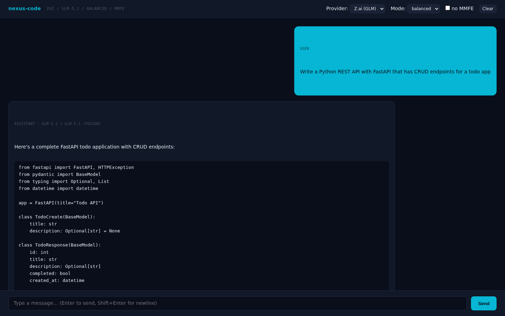

# Nexus-Dev MMFE


**Multi-Model Fusion Engine** — an adaptive multi-model orchestrator that decomposes complex requests, routes each subtask to the GLM model best suited for it, executes in parallel, and synthesizes results into a single coherent answer. Built on `z-ai-web-dev-sdk`.

Now ships with **Nexus Code** — a terminal AI coding assistant (`nexus-code`) that lets you chat with GLM, OpenAI, Anthropic, and any OpenAI-compatible endpoint from one terminal, with MMFE built in.

---

## What's inside

| Package           | Path                  | Description                                               |
| ----------------- | --------------------- | --------------------------------------------------------- |
| **nexus-dev-mmf** | `/` (root)            | The orchestrator SDK + CLI                                |
| **nexus-code**    | `packages/nexus-code` | Nexus Code — terminal AI coding assistant (NEW in v1.1.0) |

---

## The orchestrator (v1.0+)

### Install

```bash
npm install nexus-dev-mmf
```

### Use

```javascript
import { createOrchestrator } from 'nexus-dev-mmf';

const orchestrator = createOrchestrator({
  defaultMode: 'balanced',
  maxParallelSubTasks: 6,
  enableThinking: true,
});

const result = await orchestrator.process('Design a microservices architecture for an e-commerce platform');

console.log(result.answer);
console.log(`Models used: ${result.modelsUsed.join(', ')}`);
console.log(`Quality score: ${result.qualityScore}/100`);
```

### Pipeline

```
Request → Decomposer (glm-5.2) → Adaptive Router → Parallel Executor → Synthesizer → Unified Result
```

### Models

| Model          | Tier     | Strengths                                             |
| -------------- | -------- | ----------------------------------------------------- |
| `glm-5.2-1m`   | Flagship | Advanced reasoning, 1M context, complex decomposition |
| `glm-5.2`      | Flagship | Baseline high-performance, balanced quality-speed     |
| `glm-5.1`      | Standard | Nuanced language, context sensitivity, summarization  |
| `glm-5`        | Fast     | Speed, efficiency, rapid drafts, high-throughput      |
| `glm-5v-turbo` | Fast     | Accelerated feedback, vision support, quick iteration |
| `glm-4.7`      | Creative | Creative generation, deep knowledge, code synthesis   |

### Execution modes

| Mode                   | Behavior                            | Use case                |
| ---------------------- | ----------------------------------- | ----------------------- |
| `speed`                | Prioritizes `glm-5`, `glm-5v-turbo` | Drafts, rapid iteration |
| `balanced` _(default)_ | Spreads across all models           | Most prompts            |
| `quality`              | Prioritizes `glm-5.2`, `glm-5.2-1m` | Final deliverables      |
| `creative`             | Biases toward `glm-4.7`             | Writing, brainstorming  |

### CLI

```bash
nexus-dev "Explain the difference between microservices and monoliths"
nexus-dev "Design a database schema" --mode quality
nexus-dev "Write a business plan" --mode creative --verbose
nexus-dev "Analyze this dataset" --parallel 3 --no-thinking
```

### Configuration

| Option                  | Default      | Description                                   |
| ----------------------- | ------------ | --------------------------------------------- |
| `defaultMode`           | `'balanced'` | Default execution mode                        |
| `maxParallelSubTasks`   | `6`          | Maximum concurrent model calls                |
| `enableThinking`        | `true`       | Enable chain-of-thought reasoning             |
| `subTaskTimeout`        | `120000`     | Timeout per subtask (ms)                      |
| `verboseRouting`        | `true`       | Include routing metadata in responses         |
| `maxDecompositionDepth` | `3`          | Maximum decomposition depth                   |
| `qualityThreshold`      | `70`         | Score threshold for re-synthesis              |
| `enableRetry`           | `true`       | Retry failed subtasks with alternative models |
| `maxRetries`            | `2`          | Maximum retry attempts per subtask            |

### Prerequisites

- Node.js 18+
- `z-ai-web-dev-sdk` installed and configured (with valid `.z-ai-config`)
- Backend execution only (SDK must not be used client-side)

---

## Nexus Code (v1.1.0+) — `nexus-code`

A terminal UI client for chatting with GLM, OpenAI, Anthropic, and any OpenAI-compatible endpoint — with MMFE built in.

> ### 🖥️ Is it a terminal app or a web app?
>
> **It is a terminal/TUI app first.** Nexus Code runs **inside your terminal** — it is _not_ a hosted web product.
>
> | Mode                        | Command       | What it is                                                                                                                                                                                                                                                  |
> | --------------------------- | ------------- | ----------------------------------------------------------------------------------------------------------------------------------------------------------------------------------------------------------------------------------------------------------- |
> | **Terminal UI (primary)**   | `nexus`       | A full-screen, interactive **terminal UI** built with [Ink](https://github.com/vadimdemedes/ink) + React. Runs natively in your console — **no browser, no server, nothing hosted online.** This is the default and what most people use.                   |
> | **Local web UI (optional)** | `nexus --web` | For convenience only. Boots a small HTTP server bound to **`127.0.0.1:3000` (your own machine)** and serves a browser chat page. The "web" UI runs **entirely on localhost** from the same CLI binary — it is never deployed or reachable over the network. |
>
> **There are no hosted/web screenshots in this repository.** Every visual you see is a **terminal/ANSI render** of the TUI, not a web page.

Inspired by [`opencode`](https://github.com/anomalyco/opencode), [`MiMo-Code`](https://github.com/XiaomiMiMo/MiMo-Code), and [`better-clawd`](https://github.com/x1xhlol/better-clawd), with all Nexus-MMFE features built in, provider unlocked, and full multi-provider support.

### Install

#### One command (recommended) — gets you a global `nexus` command

```bash
git clone https://github.com/roman-ryzenadvanced/nexus-dev-mmf.git
cd nexus-dev-mmf
node scripts/setup.mjs        # ⭐ installs + builds + enables `nexus` globally
```

After it finishes, run **`nexus`** from anywhere. (`npm run setup` works too.)

The script handles the npm-workspaces quirk that breaks plain `npm link`,
verifies `nexus --version` resolves on your PATH, and prints next steps for
your API key.

#### From npm (when published)

```bash
npm install -g nexus-code
```

#### Run from source (no global command)

```bash
git clone https://github.com/roman-ryzenadvanced/nexus-dev-mmf.git
cd nexus-dev-mmf/packages/nexus-code
npm install
npm run build
node bin/nexus.js
```

> The from-source steps build the TUI but do **not** create a global `nexus`
> command. Run `node scripts/setup.mjs` from the repo root to get `nexus` on
> your PATH.

#### Add your API key

```bash
# Z.ai (GLM — MMFE native, free tier available). Get a key at https://z.ai:
mkdir -p ~/.config
printf '{"apiKey":"YOUR_ZAI_KEY","baseUrl":"https://open.bigmodel.cn/api/coding/paas/v4"}' > ~/.z-ai-config
chmod 600 ~/.z-ai-config

# Or: launch nexus, then use the /provider picker to switch providers and add
# any OpenAI / Anthropic key inline.
```

Then start coding:

```bash
nexus
```

### Features

- ✅ **Three provider kinds**: OpenAI-compatible, Anthropic, Z.ai (MMFE native)
- ✅ **Auto-fetch models** via `/v1/models` for OpenAI + Anthropic
- ✅ **Manual model add** via `/add` slash command or config file
- ✅ **MMFE orchestrator** built in — mode switcher, routing panel, quality score
- ✅ **Provider unlocked** — bypass MMFE with `/mmfe off` for direct provider calls
- ✅ **Streaming responses** with token-by-token rendering
- ✅ **Slash commands**: `/mode`, `/model`, `/provider`, `/clear`, `/save`, `/load`, `/fetch`, `/add`, `/mcp`, `/help`, `/exit`
- ✅ **Input history** (↑/↓ arrow navigation)
- ✅ **Session persistence** — save and load chat transcripts
- ✅ **File context** tools (`fs`, `shell`, `diff`)
- ✅ **MCP support** (Model Context Protocol) — stdio + HTTP transports
- ✅ **Tech-dark theme** matching the MMFE brand

### Screenshots

**Web UI** — Browser-based chat interface launched with `nexus --web`. Features SSE streaming, provider/model/mode selectors, MMFE toggle, and quality scoring.



**Dashboard** — Interactive HTML5 monitoring dashboard with live pipeline stats, model performance, cost tracking, and event log.


### Quick start

```bash
# Set API keys (any subset)
export ZAI_API_KEY=...
export OPENAI_API_KEY=...
export ANTHROPIC_API_KEY=...

# Boot the TUI
nexus
```

### First-run setup

On first launch, `nexus-code` creates `~/.nexus/config.json` with three default providers (zai, openai, anthropic). Edit it to add custom providers, API keys, or manual model entries.

See [`examples/config.json`](./packages/nexus-code/examples/config.json) for a full example.

### Slash commands

Type **`/`** in the input box to auto-open a filterable command menu — keep typing to filter,
**↑↓** to navigate, **↵** to run, **esc** to cancel.

```
/help                          List all slash commands
/mode [speed|balanced|quality|creative]
/provider [id]                 Switch active provider
/model [id]                    Switch active model
/models                        List models for active provider
/fetch [providerId]            Auto-fetch models from /v1/models
/add <providerId> <modelId> [label]
/clear                         Clear transcript
/save [name]                   Save current session
/load <name>                   Load a saved session
/sessions                      List saved sessions
/continue [name|index]         Resume a saved session
/new                           Start a fresh session (drops auto-restore)
/observer [on|off|<model>]     Toggle the side-channel Observer (or set its model)
/mmfe [on|off]                 Toggle MMFE on/off
/mcp                           List MCP servers
/exit                          Quit
```

CLI flags for sessions: `nexus --continue [name]` resumes a session,
`nexus --new` starts fresh (skips auto-restore of the last session).

Full reference: [`docs/commands.md`](./packages/nexus-code/docs/commands.md)

### Adding a custom provider

Edit `~/.nexus/config.json`:

```json
{
  "providers": [
    {
      "id": "openrouter",
      "kind": "openai",
      "name": "OpenRouter",
      "baseURL": "https://openrouter.ai/api/v1",
      "apiKey": "sk-or-...",
      "mmfe": false,
      "defaultModel": "anthropic/claude-3.5-sonnet"
    },
    {
      "id": "ollama-local",
      "kind": "openai",
      "name": "Ollama (local)",
      "baseURL": "http://localhost:11434/v1",
      "mmfe": false,
      "defaultModel": "llama3.1:8b"
    }
  ]
}
```

Then in the TUI:

```
/provider openrouter
/fetch                          # pull model list from /v1/models
```

### Provider-unlocked mode (no MMFE)

```
/mmfe off                       # bypass orchestrator, call provider directly
```

When MMFE is off, requests go straight to the active provider — no decomposition, no routing, no quality score. Useful when you want a single deterministic response from a specific model.

### Keyboard shortcuts

| Key                             | Action                                                   |
| ------------------------------- | -------------------------------------------------------- |
| `Enter`                         | Submit prompt or slash command                           |
| `Shift+Enter`                   | Insert newline (multi-line input)                        |
| `↑` / `↓`                       | Navigate input history (or slash menu when `/` is typed) |
| `/` then ↑/↓ ↵                  | Slash command menu — filter, navigate, run               |
| `PageUp` / `PageDn` / `Ctrl+↑↓` | Scroll transcript (auto-follows while streaming)         |
| `Tab`                           | Complete current word                                    |
| `Ctrl+P`                        | Toggle command palette                                   |
| (while streaming) `o` / `q`     | Observer answers now / queue for the main agent          |
| `Ctrl+C` (streaming)            | Abort current request (clears queue)                     |
| `Ctrl+C` (idle)                 | Quit                                                     |

### Architecture

See [`docs/architecture.md`](./packages/nexus-code/docs/architecture.md).

---

## Integrate from other agents + chat.z.ai

### From other AI agents (Claude, ChatGPT, Cursor, Cline, LangChain, AutoGen, CrewAI)

The orchestrator is just a function — wrap it as a tool:

```javascript
import { createOrchestrator } from 'nexus-dev-mmf';

const orchestrator = createOrchestrator({ defaultMode: 'balanced' });

export const nexusTool = {
  name: 'nexus_mmfe',
  description: 'Multi-model fusion engine. Use for complex multi-domain prompts.',
  schema: { prompt: 'string', mode: 'speed|balanced|quality|creative' },
  run: async ({ prompt, mode }) => {
    const r = await orchestrator.process(prompt, { preferredMode: mode });
    return {
      answer: r.answer,
      modelsUsed: r.modelsUsed,
      qualityScore: r.qualityScore,
      routingDecisions: r.routingDecisions,
    };
  },
};
```

- **Cursor / Cline**: register as an MCP server (stdio transport)
- **LangChain / LlamaIndex**: wrap as a custom `LLMChain` with router-retainer memory
- **AutoGen / CrewAI**: register as a group-chat member with the `decomposer` role

### Inside chat.z.ai

1. Open chat.z.ai — start a new conversation in a workspace where the `nexus-dev-mmf` skill is enabled
2. Type `/nexus` to invoke the MMFE skill
3. Specify mode + prompt: `/nexus quality: design a REST API for inventory sync`
4. Each response includes routing decisions, models used, and quality score
5. Iterate — follow-up messages reuse the prior routing context; switch modes mid-thread with `/nexus creative`

---

## Documentation

- [Features](./packages/nexus-code/docs/FEATURES.md) — every feature, version added, how to use
- [Tests](./packages/nexus-code/docs/TESTS.md) — every test suite, what it covers, how to run
- [Root Cause Analysis](./packages/nexus-code/docs/ROOT-CAUSE-ANALYSIS.md) — every bug, root cause, exact fix
- [Release Notes v1.1.7](./packages/nexus-code/docs/RELEASE-NOTES-v1.1.7.md) — consolidated release notes
- [Nexus Code — Providers](./packages/nexus-code/docs/providers.md)
- [Nexus Code — Slash commands](./packages/nexus-code/docs/commands.md)
- [Nexus Code — MCP integration](./packages/nexus-code/docs/mcp.md)
- [Nexus Code — Architecture](./packages/nexus-code/docs/architecture.md)
- [Nexus Code — Example config](./packages/nexus-code/examples/config.json)

---

## Releases

See [CHANGELOG.md](./CHANGELOG.md) for the full release history.

### v1.2.0 — production-quality TUI (streaming fix, live metrics, scrollback, sessions, Observer)

- **FIXED**: "no response" while streaming — proper SSE parser for Z.ai/GLM streams (content + tool-call deltas)
- **FIXED**: tool-calling chains now round-trip correctly across multiple rounds
- **FIXED**: MMFE streaming bypass — fused results now stream through `onDelta`
- **FIXED**: ESM `__dirname` crashes in the design engines
- **ADDED**: Live metrics — real token speed/counter during direct streams, plus live MMFE fusion progress (`executing 2/4 …`) forwarded from orchestrator events
- **ADDED**: koda-style line-window viewport (ChatView rewrite) — eliminates overlap / cut-off / disappearing-input; word-wrapped to terminal width
- **ADDED**: Scrollback — PageUp / PageDown / Ctrl+↑↓ with auto-follow + scroll indicator
- **ADDED**: Multi-model message headers — all involved models, humanized time, tokens, tok/s, quality score
- **ADDED**: Streaming animation (roller + dots, no extra deps) and a boot animation
- **ADDED**: Slash command menu — type `/` to auto-open a filterable command list (↑↓ navigate, ↵ run, esc cancel)
- **ADDED**: Session picker on boot — choose to start fresh or resume a saved conversation (`↑↓` move, `↵` select, `n`/`esc` new). `--new` / `--continue [name]` skip the picker.
- **ADDED**: Type while streaming — follow-ups queue with a `[N queued]` hint; Ctrl+C aborts + clears
- **ADDED**: Session persistence — auto-resume last session, debounced auto-save, `/sessions`, `/continue [name|index]`, `/new`, `--continue` / `--new`
- **ADDED**: Observer 👁 — when you message during a stream, choose **queue** or **Observer** (a cheap side-channel model that answers now). `/observer [on|off|<model>]`

### v1.1.7 — rebrand to Nexus Code

- **CHANGED**: Package renamed `nexus-tui` → `nexus-code` on npm
- **CHANGED**: Binary adds `nexus-code` alias (keeps `nexus` as primary)
- **CHANGED**: All in-app branding strings: header, help, status, wizard, web UI, pipe mode, error messages
- **CHANGED**: All docs, CI workflows, publish script paths updated
- No functional changes — pure branding rename

### v1.1.6 — close the gaps

- **FIX**: Plugin commands now wired into `/help` + `runSlash` — previously loaded but unreachable
- **NEW**: Web UI HTTP integration tests (11) — boots real server, fires real `fetch()` against every endpoint
- **NEW**: Config wizard interactive-mode tests (7) — mocked readline, verifies user choices written
- **NEW**: Plugin loader end-to-end tests (15) — register/unregister, runSlash integration, real `.mjs` file load → execute
- **NEW**: Coverage 56% → 65% (threshold 40%)
- **NEW**: 230 tests passing + 8 env-gated smoke tests (was 196)

### v1.1.5 — full feature parity pass

- **NEW**: `/diff <path> [against]` — git diff inline
- **NEW**: Multi-line input (Shift+Enter for newline)
- **NEW**: `nexus init` + `/init` — interactive config wizard
- **NEW**: Plugin system — load custom tools/commands from `~/.nexus/plugins/*.js`
- **NEW**: `/branch <msgId|idx>` — fork conversation from a past message
- **NEW**: `nexus --web` — local HTTP server + browser chat UI (SSE streaming, markdown, tool calls)
- **NEW**: Real Ink component tests (StatusBar, HelpOverlay, ChatView)
- **NEW**: 20 slash commands (was 16), 196 tests + 8 env-gated smoke tests
- **NEW**: `/plugins` command — list loaded plugins + errors

### v1.1.4 — CI/CD + theming + autocomplete + pipe mode

- **NEW**: 3 GitHub Actions workflows (CI matrix on Node 18/20/22, npm publish on tag, GitHub Release with auto-extracted changelog)
- **NEW**: 3 TUI color themes (`tech-dark`, `editorial-light`, `hacker-terminal`) + `/theme` command + persistence
- **NEW**: Tab autocomplete — slash commands + history entries, cycle with repeated Tab
- **NEW**: Pipe mode — `echo "prompt" | nexus` reads stdin, responds, exits (great for scripting)
- **NEW**: Anthropic streaming now captures tool calls from `finalMessage()`
- **NEW**: Coverage thresholds enforced (40% min, currently 61%)
- **NEW**: `npm run test:coverage` + `npm run test:smoke` scripts
- **NEW**: 5 README badges (CI, npm, coverage, license, Node)
- **FIX**: OpenAI/Anthropic providers no longer crash on construction without API keys (lazy client)
- **FIX**: `bin/nexus.js` rewritten as plain JS (was crashing on TS annotations)
- **NEW**: 16 slash commands (was 15), 152 tests + 8 env-gated smoke tests

### v1.1.3 — streaming pipeline + observability + smoke tests

- **NEW**: `sendChatStream()` orchestrator — uses provider's `streamChat()`, falls back to non-streaming automatically
- **NEW**: Tool-call capture from streaming responses (OpenAI accumulates `tool_calls` deltas across chunks)
- **NEW**: `/status` command — full system snapshot (providers, models, MCP, session)
- **NEW**: Input history persisted to `~/.nexus/history.json` (500 entries, cross-session)
- **NEW**: `/history [query]` command — search past prompts with timestamps
- **NEW**: ESLint config — 0 errors, 0 warnings on `npm run lint`
- **NEW**: Real-API smoke tests (env-gated) — OpenAI + Anthropic + Z.ai
- **NEW**: 15 slash commands (up from 11)
- **NEW**: 123 tests passing + 8 env-gated smoke tests
- **FIX**: MCPClient no longer emits unhandled `EPIPE` errors on dead children

### v1.1.2 — tool calling + streaming + command palette

- **NEW**: Provider-agnostic tool calling — pass `tools=[...]` to any provider, models can call tools, orchestrator executes them and feeds results back (up to `maxToolRounds` = 5)
- **NEW**: Streaming via `streamChat()` async generator on all 3 providers (OpenAI, Anthropic, Z.ai)
- **NEW**: Command palette (Ctrl+P) — fuzzy-filter slash commands, ↑↓ navigate, ↵ pick
- **NEW**: Live MCP integration tests against `@modelcontextprotocol/server-filesystem`
- **NEW**: Mocked-HTTP integration tests for OpenAI + Anthropic providers (request construction + response parsing)
- **NEW**: 114 tests total (up from 78), all passing
- **FIX**: MCPClient no longer crashes on non-existent commands (suppressed unhandled `ENOENT`)
- **FIX**: Anthropic `input_schema.type: 'object'` enforced

### v1.1.1 — production-readiness pass

- **FIX**: All TypeScript errors resolved (0 errors, strict mode)
- **NEW**: 78 vitest tests across 7 suites — all passing
- **NEW**: Provider-agnostic tool calling protocol (`ToolRegistry` + `toOpenAITools` + `toAnthropicTools`)
- **NEW**: 5 builtin tools — `read_file`, `write_file`, `shell`, `diff`, `apply_diff`
- **NEW**: MCP client runtime — stdio + HTTP transports, auto-registers remote tools
- **NEW**: Retry + error recovery — exponential backoff with jitter, retryable status codes
- **NEW**: `/mcp` and `/tools` slash commands
- **FIX**: Z.ai provider rewritten to match real `z-ai-web-dev-sdk@0.0.18` API
- **FIX**: Anthropic provider uses raw `fetch()` for `/v1/models` (SDK doesn't expose `.models.list()`)
- **NEW**: `streamChat()` async generator on Z.ai provider

### v1.1.0 — `nexus-code` terminal UI client

- **NEW**: Ink + TypeScript TUI client (`packages/nexus-code`)
- **NEW**: Three provider kinds (OpenAI-compatible, Anthropic, Z.ai MMFE-native)
- **NEW**: Auto-fetch models via `/v1/models`
- **NEW**: Manual model add via `/add` slash command
- **NEW**: Provider-unlocked mode (bypass MMFE)
- **NEW**: Slash command system with 11 builtins
- **NEW**: Session persistence (save/load)
- **NEW**: File context tools (fs, shell, diff)
- **NEW**: MCP support (stdio + HTTP)

### v1.0.0 — Initial release

- Multi-Model Fusion Engine (Decomposer → Router → Executor → Synthesizer)
- Six GLM models (`glm-5.2-1m`, `glm-5.2`, `glm-5.1`, `glm-5`, `glm-5v-turbo`, `glm-4.7`)
- Four execution modes (speed, balanced, quality, creative)
- `nexus-dev` CLI
- z-ai-web-dev-sdk integration

---

## License

MIT © [roman-ryzenadvanced](https://github.com/roman-ryzenadvanced)
